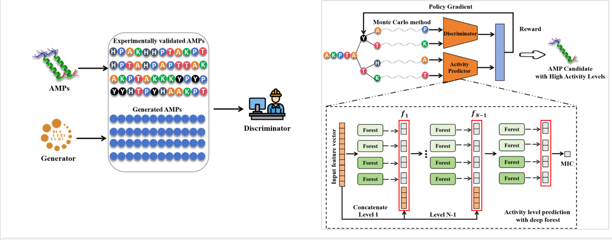

# AMPDesign

Antimicrobial resistance poses a threat to human well-being, especially with the emergence of multidrug-resistant bacteria. Antimicrobial peptides (AMPs), as one of the most promising alternatives to traditional antibiotics, have attracted significant attention in recent years. However, designing AMPs using traditional experimental methods is time-consuming and labor-intensive. Therefore, in this study, we propose an out-of-the-box AMP design toolbox, named AMPDesign. 

AMPDesign is a novel computational tool designed for the generation of antimicrobial peptide (AMP) sequences. It integrates the Generative Adversarial Network (GAN) architecture and Reinforcement Learning (RL), incorporates our previously developed activity predictor [AMPActiPred](https://onlinelibrary.wiley.com/doi/10.1002/pro.5006) model to produce peptides with high antimicrobial efficacy. Notably, AMPDesign is the first AMP generation toolbox capable of designing AMPs against specific bacterial species.

The platform's versatility is demonstrated through its capacity to generate AMPs targeting 10 distinct bacterial species. Researchers can access the comprehensive training datasets and the  prediction model via the [AMPActiPred website](https://awi.cuhk.edu.cn/~AMPActiPred/download.php), facilitating further exploration and application in the field of antimicrobial peptide design.



## Requirement

**查询requirement**

We suggest you run the platform under Python 3.7+ with following libs: 

- TensorFlow == 1.13.1
- Numpy >= 1.21
- Scipy >= 1.7.3
- NLTK == 3.7
- deep-forest == 0.1.7
- biopython == 1.81

Or just type `pip install -r requirements.txt` in your terminal.

## Quick tutorial

```bash
git clone https://github.com/DamarisDeng/AMPDesign.git
cd AMPDesign
```

The basic usage is

```bash
python AMPDesign.py -s <microbial-type> -a <model-loc> -d <training-data> -o <output-data>

# example
python AMPDesign.py -s Ec -a prediction/models/Ec/ -d train.txt -o output.txt
```

Arguments:

- `-s`: This is used to specify the type of microbial your peptides belong, you can choose from 10 different species, including E. coli (Ec), M. luteus (Ml), K. pneumoniae (Kp), P. aeruginosa (Pa), A. baumannii (Ab), E. feacalis (Ef), S. typhimurium (St), S. aureus (Sa), S. epidermidis (Se), B. subtilis (Bs).
- `-a`: Specify the path of model. Models can be downloaded from [AMPActiPred website](https://awi.cuhk.edu.cn/~AMPActiPred/download.php).
- `-o`: Specify the output file path.
- `-d`: the training sequence. 
  - The training data should be a .txt file, with each line containing a peptide sequence.

```
# sample training data
AAGMGFFGAR
AAHCLAIGRR
KKAFAAAAAFAAWAAFAKKKK
AIHKLAHKLTKKTLRAVKKLAN
GWGDTFGKVLKNFAKVAGVKAAK
```